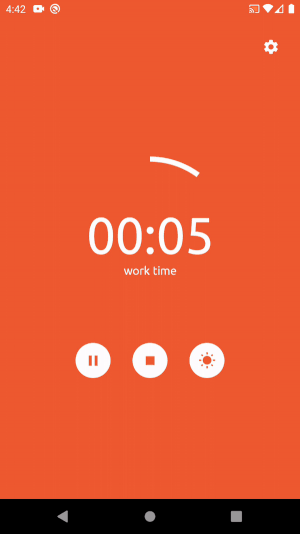
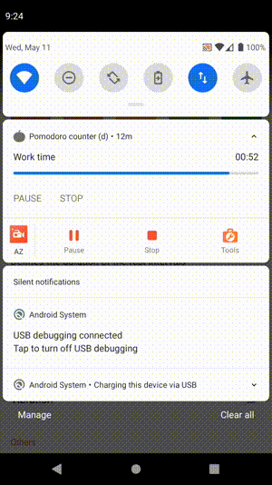
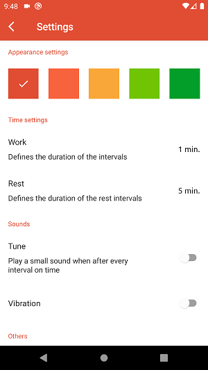

# Pomodoro timer 

It's a simple anti procrastination app that helps you to focus and get your tasks done.

# Table of contents
- [How it works?](#how-it-works)
- [Android tech stack](#android-tech-stack)
- [Would you like to contribute?](#would-you-like-to-contribute)
- [Extra resources](#extra-resources)

## How it works?
The app follow the [Pomodoro Technique](https://en.wikipedia.org/wiki/Pomodoro_Technique), breaking the time into two intervals, 25 min to work and 5 min to rest.

When you minimize the app, you can still controll the countdown from your device's notifications.

You can set the time of the intervals, enable sounds and vibration, keep screen on and change the color theme.

## Android tech stack
- Written in kotlin
- [Jetpack compose](https://developer.android.com/jetpack/compose)
- [Coroutines](https://developer.android.com/kotlin/coroutines)
- [Preference DataStore](https://developer.android.com/topic/libraries/architecture/datastore)
- [Koin](https://insert-koin.io/)
- Clean architecture
- [Ktlint](https://github.com/pinterest/ktlint), [lint](https://developer.android.com/studio/write/lint) and [detekt](https://github.com/detekt/detekt)

## Would you like to contribute?
Feel free to open an **issue** and tell me about your idea or create a **pull request**, just make sure to read before the [CONTRIBUTING](CONTRIBUTING.md) guide.

## Extra resources
- [Figma design](https://www.figma.com/file/Y6oJ51KCgG7vcZNQN8ZDu0/Pomodoro)
